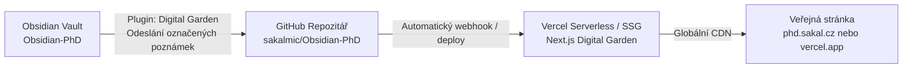

---
{"dg-publish":true,"permalink":"/system/digital-garden-and-vercel-deployment-guide/","tags":["type/guide","context/phd","theme/system"],"dgHomeLink":true,"noteIcon":"","created":"2026-09-01","updated":"2026-09-01","dg-note-properties":{"aliases":["Digital Garden & Vercel Deployment Guide","Digital Garden Setup"],"tags":["type/guide","context/phd","theme/system"],"date":"2026-09-01","last_updated":"2026-09-01"}}
---


# 🌐 Digital Garden & Vercel Deployment Guide

Tento návod krok za krokem vysvětluje, jak publikovat vybrané části vašeho doktorského vaultu **Obsidian-PhD** na internet jako moderní, rychlou a responzivní digitální zahradu pomocí **GitHubu** a **Vercelu**.

---

## 🏗️ Architektura publikace



---

## 🚀 Postup zprovoznění (One-Time Setup)

### 1. Krok: Vytvoření repozitáře na GitHubu
1. Přihlaste se na GitHub (`sakalmic`).
2. Vytvořte nový repozitář s názvem např. `Obsidian-PhD` (může být Public i Private).
3. Vygenerujte si **GitHub Personal Access Token (classic)** nebo **Fine-grained Token**:
   - Oprávnění: `repo` (Full control of private repositories).
   - Zkopírujte vygenerovaný token (začíná např. `ghp_...` nebo `github_pat_...`).

### 2. Krok: Nasazení na Vercel (1-Click Deployment)
1. Přejděte na oficiální šablonu [oleeskild/digitalgarden na GitHubu](https://github.com/oleeskild/digitalgarden).
2. Klikněte na tlačítko **Deploy with Vercel**.
3. Propojte svůj GitHub účet a zvolte repozitář pro Digital Garden (nebo nechte Vercel vytvořit fork do vašeho účtu).
4. Vercel automaticky zbuildí a nasadí web. Získáte URL adresu (např. `https://phd-sakalmic.vercel.app`).

### 3. Krok: Nastavení pluginu v Obsidianu
1. V Obsidianu otevřete `Nastavení` ➔ `Digital Garden`.
2. Vyplňte pole:
   - **GitHub Repo Name**: `Obsidian-PhD`
   - **GitHub User Name**: `sakalmic`
   - **GitHub Token**: Vložte váš vygenerovaný token.
   - **Garden Base URL**: Zadejte vaši Vercel URL (např. `https://phd-sakalmic.vercel.app`).
3. Klikněte na **Test connection**. Jakmile se objeví zelené potvrzení, propojení je hotové!

---

## 📝 Jak publikovat poznámky

Publikaci každé jednotlivé poznámky plně ovládáte přímo v jejím frontmatteru (YAML):

```yaml
---
dg-publish: true        # Způsobí publikaci této poznámky na web
dg-home-link: true      # Zobrazí odkaz na domovskou stránku v záhlaví
dg-show-backlinks: true  # Zobrazí zpětné odkazy na konci článku
dg-show-local-graph: true# Zobrazí interaktivní graf sousedních poznámek
---
```

### Hromadná publikace a synchronizace:
1. V levém postranním panelu nebo příkazové paletě (`Ctrl+P`) zvolte:  
   `Digital Garden: Publication Center` (Centrum publikací).
2. Zobrazí se seznam poznámek:
   - **Zelené**: Nové poznámky s `dg-publish: true` připravené k nahrání.
   - **Žluté**: Změněné poznámky připravené k aktualizaci.
   - **Červené**: Poznámky, které byly z webu odebrány.
3. Klikněte na **Publish Changed Notes** (Publikovat změněné poznámky).
4. Do několika sekund Vercel stránku aktualizuje.

---

## 🔒 Bezpečnost a soukromí

> [!IMPORTANT]
> - Pouze poznámky obsahující `dg-publish: true` budou odeslány na GitHub / Vercel.
> - Interní dokumenty (finance, rozpočty grantů, zápisy ze schůzek, osobní deníky) mají v šablonách nastaveno `dg-publish: false` a **nikdy se na web nedostanou**.
> - Citlivé konfigurační soubory jsou chráněny v souboru `.gitignore`.
