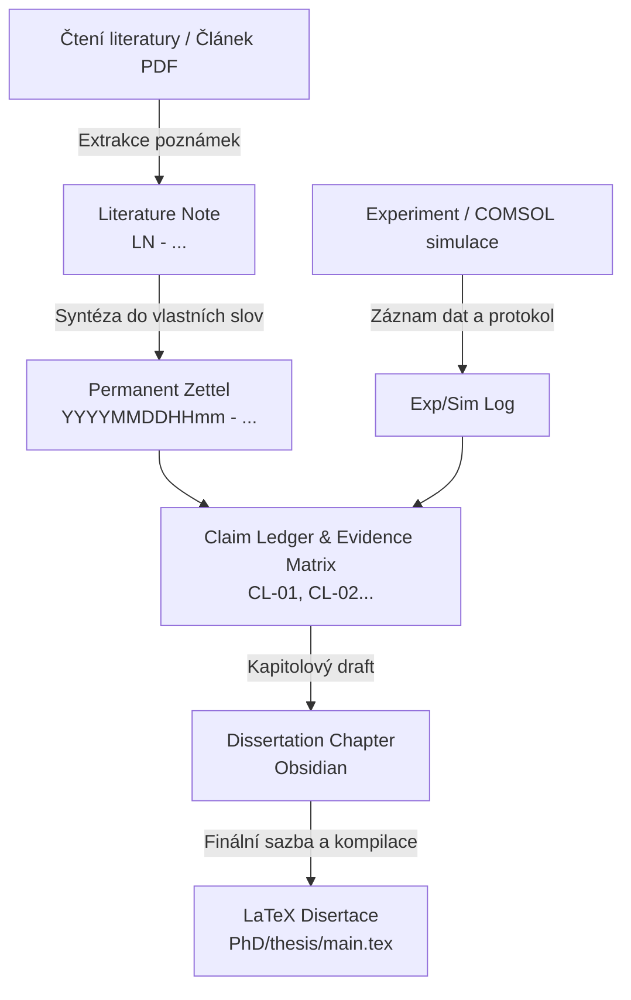

---
{"dg-publish":true,"permalink":"/system/research-methodology-and-workflows/","tags":["type/guide","context/phd","theme/system"],"dgHomeLink":true,"noteIcon":"","created":"2026-09-01","updated":"2026-09-01","dg-note-properties":{"aliases":["Research Methodology & Workflows","Scientific Workflow"],"tags":["type/guide","context/phd","theme/system"],"date":"2026-09-01","last_updated":"2026-09-01"}}
---

# 🔬 Research Methodology & Workflows

Tento dokument definuje osvědčené vědecké a znalostní pracovní postupy (workflows) integrované do systému **Obsidian-PhD**:

---

## 1. Znalostní cyklus: Zettelkasten & Claim Ledger

### Pravidla pro tvorbu Zettelů:
1. **Jedna myšlenka na poznámku (Atomicita)**: Poznámka musí dávat smysl sama o sobě i za 5 let.
2. **Vlastní formulace**: Nikdy nekopírujte doslovný text bez parafráze; skutečné porozumění vzniká formulací vlastních vět.
3. **Obousměrné propojení**: Každý Zettel musí mít odkaz na nadřazený koncept (Up), související koncepty (Side) a zdrojový článek (Literature source).

---

## 2. Claim Ledger (Matice tvrzení a důkazů)

Pro doktorskou práci je klíčová evidence-based kontrola. Žádné tvrzení v dizertaci nesmí být nepodložené:
- **Claim ID** (např. `CL-01`): Formulace vědecké hypotézy / závěru.
- **Důkaz (Primary Evidence)**: Číslo datasetu z měření nebo COMSOL parametrického sweepu.
- **Publikační výstup**: Článek v IEEE / APL s recenzním řízením potvrzující platnost.

---

## 3. Rytmus hluboké práce (Ultradian Research Sessions)

- **90 minut Deep Work**: Plné soustředění na psaní kódu COMSOLu, odvozování rovnic nebo psaní kapitol.
- **20 minut Active Break**: Pohyb, protažení, reflexe.
- **Denní logbook (`Daily/`)**: Zápis ranního cíle, dokončených bloků a 3 priorit na další den.
