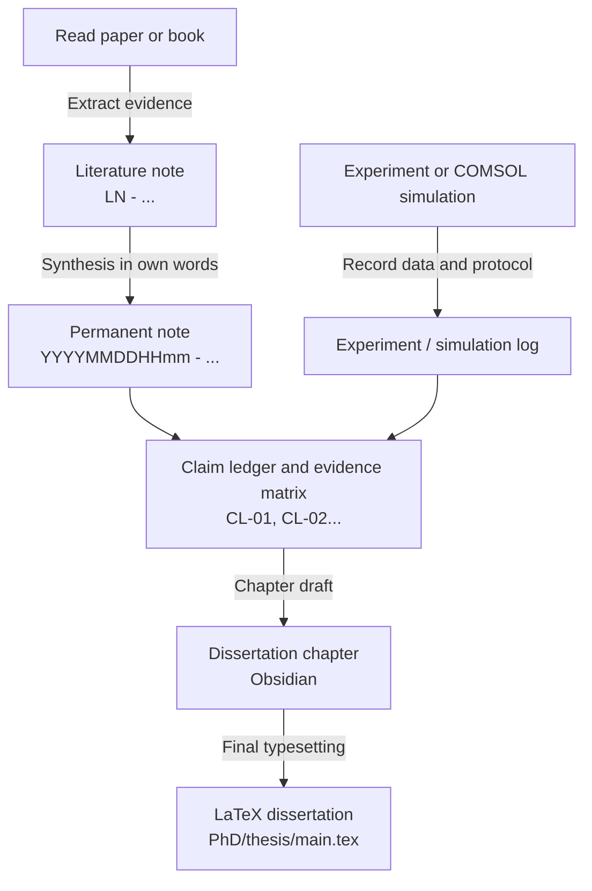

---
{"dg-publish":true,"permalink":"/system/research-methodology-and-workflows/","tags":["type/guide","context/phd","theme/system"],"dgHomeLink":true,"noteIcon":"","created":"2026-09-01","updated":"2026-09-01","dg-note-properties":{"aliases":["Research Methodology & Workflows","Scientific Workflow"],"tags":["type/guide","context/phd","theme/system"],"date":"2026-09-01","last_updated":"2026-09-01"}}
---

# Research Methodology & Workflows

This document defines the scientific and knowledge-management workflows used throughout **Obsidian-PhD**.

---

## 1. Knowledge cycle: Zettelkasten and claim ledger

### Rules for permanent notes

1. **One idea per note:** A permanent note must remain intelligible on its own.
2. **Original wording:** Paraphrase the source and record the reasoning; do not substitute copied passages for understanding.
3. **Bidirectional context:** Link every note to a parent concept, related concepts and its literature source.
4. **Evidence traceability:** Distinguish clearly between published evidence, measured data, simulation results and working hypotheses.

---

## 2. Claim ledger

Every principal dissertation claim is recorded with:

- a stable **Claim ID** such as `CL-01`;
- a precise scientific statement or hypothesis;
- primary evidence from an experiment, dataset or simulation;
- the dissertation chapter that uses the claim;
- a publication output and current verification status.

The [[II Areas/02_Thesis/Claim Ledger & Evidence Matrix\|Claim Ledger & Evidence Matrix]] is the authoritative map between data, arguments and publications.

---

## 3. Deep-work rhythm

- **90-minute research block:** Focused work on modelling, equations, experiments or writing.
- **20-minute active break:** Movement, recovery and short reflection.
- **Daily log:** Record the main objective, completed blocks, decisions, open questions and the next three priorities.
- **Weekly review:** Reconcile project notes, evidence records and the dissertation outline.
