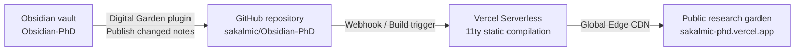

---
{"dg-publish":true,"permalink":"/system/digital-garden-and-vercel-deployment-guide-nb-rog-s5e/","tags":["type/guide","context/phd","theme/system"],"dgHomeLink":true,"noteIcon":"","created":"2026-09-01","updated":"2026-09-02","dg-note-properties":{"aliases":["Digital Garden & Vercel Deployment Guide","Digital Garden Setup"],"tags":["type/guide","context/phd","theme/system"],"date":"2026-09-01","last_updated":"2026-09-02"}}
---


# Digital Garden & Vercel Deployment Guide

This guide describes how selected notes from the **Obsidian-PhD** vault are published as a fast, responsive digital garden through GitHub and Vercel.

---

## Publication architecture



---

## Model A and URL Stability

Under **Model A**, notes in `II Areas/01_Research/` and other areas are stored in flat directories:
- Every note has a clean, permanent slug (e.g. `/laser-induced-plasma-dynamics/`, `/diagnostics-timing-emp-and-radiation/`).
- Adjusting a note's pillar classification via `#theme/...` tags does **not** change its URL or break incoming external citations or bookmarks.

---

## Frontmatter Requirements

### Standard Public Research Note

```yaml
---
title: "Note Title"
tags:
  - type/study
  - context/research
  - theme/physics/plasma-dynamics
status: evergreen
date: 2026-09-02
last_updated: 2026-09-02
dg-publish: true
dg-home-link: true
dg-show-backlinks: true
---
```

### Dynamic Dashboard / Map of Content (MOC)

For MOCs and dashboard notes with Dataview queries (e.g., [[Home\|Home]], [[II Areas/01_Research/01_MOC\|01_MOC]]):

```yaml
---
dg-publish: true
dg-home-link: true
dg-render-dataview: true
---
```
> [!important]
> The property `dg-render-dataview: true` instructs the Digital Garden plugin to pre-render Dataview query outputs into static HTML before pushing to GitHub, allowing the Vercel site to display live, formatted tables without client-side JavaScript execution.

---

## Publishing Workflow

1. Open Obsidian and launch the command palette (`Ctrl+P`).
2. Select **Digital Garden: Publication Center**.
3. The modal will list:
   - **New notes** marked `dg-publish: true` to add.
   - **Changed notes** that have been modified locally.
   - **Deleted notes** to be pruned from GitHub.
4. Click **Publish Changed Notes**.
5. The plugin commits markdown files to `sakalmic/Obsidian-PhD`, triggering a Vercel build (typically completes in 30–45 seconds).
6. Verify the live site at [sakalmic-phd.vercel.app](https://sakalmic-phd.vercel.app/).

---

## Interactive Features on Vercel

1. **Backlinks Explorer:** Setting `dg-show-backlinks: true` renders a "Notes linking to this note" footer. This automatically lists all child notes, zettels, and experiment logs linking up to that pillar.
2. **Interactive Local Graph:** Readers can explore the network of adjacent research notes directly in their browser.
3. **File Tree & Tag Navigation:** Tags (such as `#theme/physics/plasma-dynamics`) act as search filters on the live garden.

---

## Privacy Checklist

- **Default State:** Any note without `dg-publish: true` is strictly local and private.
- **Private Areas:** Areas `04_Administration`, `05_Teaching`, and `06_Grants_Funding` are marked `dg-publish: false`.
- **Dataview Leak Prevention:** When writing Dataview queries on public notes, always include `WHERE ... AND dg-publish = true` to prevent uncommitted or private note titles from appearing in public tables.
