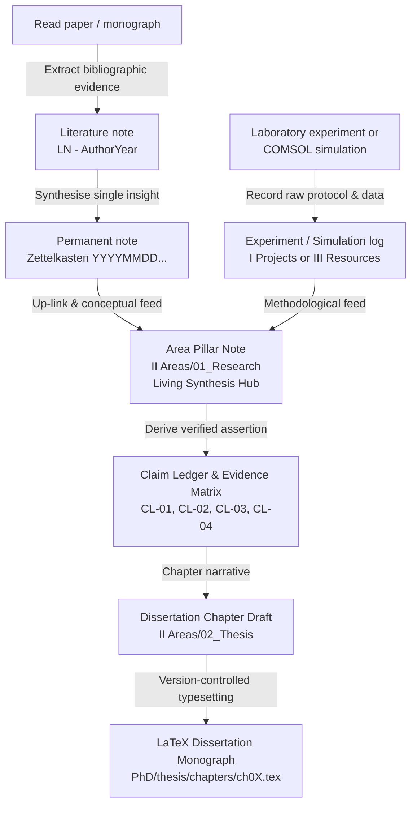

---
{"dg-publish":true,"permalink":"/system/research-methodology-and-workflows/","tags":["type/guide","context/phd","theme/system"],"dgHomeLink":true,"noteIcon":"","created":"2026-09-01","updated":"2026-09-02","dg-note-properties":{"aliases":["Research Methodology & Workflows","Scientific Workflow"],"tags":["type/guide","context/phd","theme/system"],"date":"2026-09-01","last_updated":"2026-09-02"}}
---

# Research Methodology & Workflows

This document defines the scientific and knowledge-management workflows used throughout **Obsidian-PhD**. It governs how literature, numerical simulations, laboratory measurements, and atomic ideas are distilled into living research pillars, verified scientific claims, and dissertation chapters.

---

## 1. The Doctoral Knowledge Cycle

---

## 2. Distinction Between Vault Layers

To avoid classification confusion in the flat **Model A** architecture:

1. **Resources · Literature (`III Resources/Literature/`):**
   - Summary of an external paper or book (`LN - ...`).
   - Objective record of authors' methodology, assumptions, and claims.
2. **Resources · Zettelkasten (`III Resources/Zettelkasten/`):**
   - Atomic permanent note (`YYYYMMDDHHmm - Title`).
   - Exactly **one concept** expressed in your own words, referencing its literature origin.
3. **Areas · Living Pillar Notes (`II Areas/01_Research/`):**
   - **Living thematic reviews and state-of-the-art syntheses** (e.g. [[II Areas/01_Research/Laser-Induced Plasma Dynamics\|Laser-Induced Plasma Dynamics]], [[II Areas/01_Research/Theory - Laser-Triggered Breakdown and Switching\|Theory - Laser-Triggered Breakdown and Switching]]).
   - They weave together multiple Zettels, equations, literature evidence, and experimental parameters.
   - Serve as the foundational scientific narrative for dissertation chapters.
4. **Projects · Active Sprints (`I Projects/`):**
   - Deliverables with a clear finish line and deadline (e.g. [[I Projects/Paper - IEEE Transactions 2026\|Paper - IEEE Transactions 2026]], [[I Projects/Grant SGS 2026-2027\|Grant SGS 2026-2027]]).
   - When completed, papers become literature entries and historical records move to `IV Archives/`.

---

## 3. Up-Linking and Backlink Discovery

Because the vault operates on flat folders, web navigation and knowledge graph discovery rely on **conceptual up-linking**:
- Every atomic note, experimental log, or literature note links to its parent pillar note (e.g., `pillar: "[[Laser-Triggered Spark Gaps (LTSG)]]"`).
- On the public Digital Garden ([sakalmic-phd.vercel.app](https://sakalmic-phd.vercel.app/)), Digital Garden automatically populates the **"Notes linking to this note"** panel at the bottom of the pillar page, transforming the pillar note into an interactive navigation hub.

---

## 4. Claim Ledger & Evidence Integrity

Every principal scientific claim in the dissertation must be traceable through the [[II Areas/02_Thesis/Claim Ledger & Evidence Matrix\|Claim Ledger & Evidence Matrix]]:

- **Claim ID:** Permanent identifier (such as `CL-01`).
- **Scientific Claim:** Quantitative hypothesis or assertion (e.g. delay reduction, electron density threshold, contact wear mitigation).
- **Primary Evidence:** Pointer to a reproducible measurement campaign (`DATA-...`) or COMSOL parameter sweep.
- **Chapter Link:** Dissertation monograph chapter using the claim.
- **Verification Status:** `Planned` $\rightarrow$ `In progress` $\rightarrow$ `Verified`.

---

## 5. Deep-Work Cadence

- **90-minute research block:** Dedicated focus on COMSOL modelling, analytical derivations, laboratory data analysis, or manuscript drafting.
- **Daily log (`_Daily/`):** Track daily focus, completed pomodoros, key decisions, and open issues.
- **Weekly review:** Sync project task lists, update Dataview status tags, and reconcile the claim ledger with recent findings.
